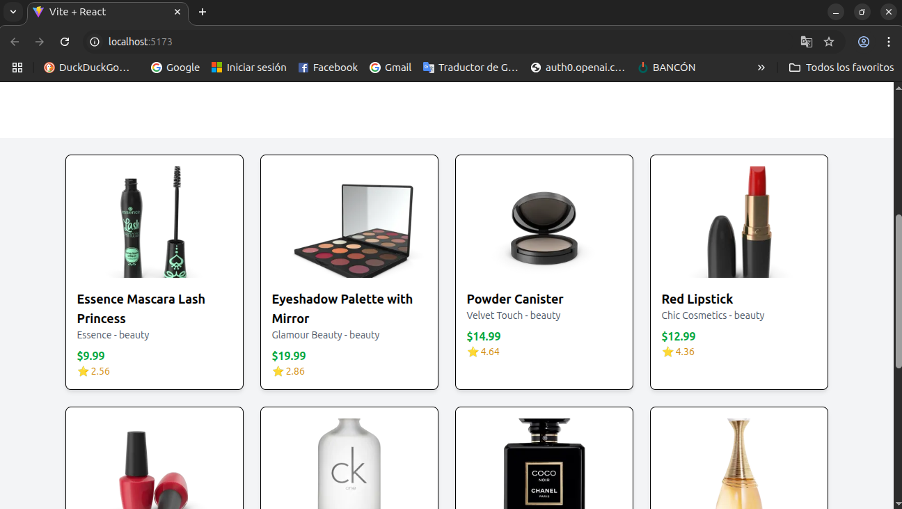

# 🛍️ Listado de Productos - React App

Este proyecto es una aplicación web hecha con **React** que muestra un listado de productos obtenidos desde la API pública de [DummyJSON](https://dummyjson.com/products). Cada producto se presenta con su imagen, título, marca, categoría, precio y puntuación.


## 🚀 Instrucciones para ejecutar el proyecto

### 1. Clonar el repositorio

```bash
git clone https://github.com/BarberoMaciel/Proyecto_Integrador_2025.git
cd tu-repo
````

### 2. Instalar dependencias

```bash
npm install
```

> Asegúrate de tener **Node.js** y **npm** instalados.

### 3. Ejecutar el servidor de desarrollo

```bash
npm run dev
```

O si usas `create-react-app`:

```bash
npm start
```

El proyecto estará disponible en:

```
http://localhost:5173/
```

*(o `http://localhost:3000/` si usaste create-react-app)*

---

## Capturas de pantalla

Vista general de la aplicación en funcionamiento:

### Captura 1


### Captura 2



---

## Dependencias principales

* React
* Axios
* Vite (o Create React App)
* Tailwind CSS

---

## Estructura del proyecto (básica)

```
├── public/
├── src/
│   ├── components/
│   │   ├── ProductCard.jsx
│   │   └── Sectionone.jsx
│   ├── App.jsx
│   ├── App.css
│   └── main.jsx
├── Ev1_Parte1_A.png
├── Ev1_Parte1_B.png
└── README.md
```

---

## Autor

* \[Maciel Barbero]

